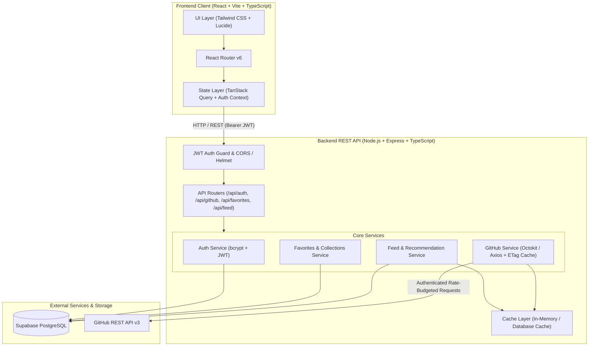

# DevHub — Technical Requirements Document (TRD)

**Project Name:** DevHub  
**Tech Stack:** React (TypeScript + Vite) + Node.js (Express + TypeScript) + Supabase PostgreSQL + GitHub REST API  
**Document Version:** 2.0 (Phase 1 + Phase 2 Unified)  
**Status:** Approved for Implementation  

---

## 1. System Architecture & Topology

DevHub is structured as a modular full-stack client-server architecture. The frontend communicates with a specialized Node.js/Express API gateway that orchestrates authentication, persists user collections, handles feed algorithms, and proxies GitHub REST API requests with caching and rate-limit shields.



---

## 2. Technology Stack & Dependencies

### 2.1 Frontend
* **Runtime / Bundler:** Vite 5+ with React 18+ and TypeScript.
* **Routing:** `react-router-dom` v6.
* **Styling & Icons:** Tailwind CSS v3 with `@tailwindcss/typography`, `clsx`, `tailwind-merge`, and `lucide-react`.
* **Server State & Caching:** `@tanstack/react-query` v5 with optimistic UI mutations.
* **Data Visualization & Charts:** `recharts` for language breakdown donuts and commit activity charts.
* **Utilities:** `date-fns` for human-readable relative time parsing.

### 2.2 Backend
* **Runtime & Framework:** Node.js 20+ with Express and TypeScript (`ts-node-dev` / `tsx` for development).
* **Security & Middleware:** `helmet` (HTTP headers), `cors` (origin lockdown), `express-rate-limit`, `cookie-parser`.
* **Validation:** `zod` or `express-validator` for strict schema validation.
* **Cryptography & Auth:** `bcryptjs` (salt factor 10), `jsonwebtoken` (HMAC SHA-256).
* **HTTP Client & Cache:** `axios` / `@octokit/rest`, `node-cache` (TTL-based in-memory caching).
* **Database Driver / ORM:** `pg` (node-postgres connection pool) or Prisma Client (`@prisma/client`).

### 2.3 Database
* **Database Engine:** PostgreSQL 15+ hosted on Supabase.
* **Migrations & Models:** SQL DDL scripts or Prisma Migrations.

---

## 3. Directory Layout (Monorepo Structure)

```
devhub/
├── frontend/
│   ├── public/
│   │   ├── favicon.svg
│   │   └── og-image.png
│   ├── src/
│   │   ├── assets/
│   │   ├── components/
│   │   │   ├── ui/               # Button, Input, Modal, Badge, Skeleton, Card, Tabs
│   │   │   ├── layout/           # Navbar, Footer, Sidebar, PageContainer
│   │   │   ├── feed/             # FeedCard, FeaturedHero, SpotlightCard, CategoryChips
│   │   │   ├── repository/       # RepoCard, LanguageBar, ContributorList, CommitTimeline
│   │   │   ├── developer/        # DeveloperCard, DeveloperHeader, TopRepos
│   │   │   └── charts/           # LanguagePieChart, ActivityAreaChart
│   │   ├── context/              # AuthContext.tsx, ThemeContext.tsx
│   │   ├── hooks/                # useFeed.ts, useGitHubSearch.ts, useFavorites.ts
│   │   ├── lib/                  # api-client.ts, utils.ts, constants.ts
│   │   ├── pages/
│   │   │   ├── Home.tsx          # Phase 2 Discovery Feed & Hero
│   │   │   ├── Explore.tsx       # Phase 1 Search Hub (Repos & Devs)
│   │   │   ├── RepositoryDetails.tsx # Phase 1 Deep Analytics View
│   │   │   ├── DeveloperProfile.tsx  # Phase 1 Developer Profile
│   │   │   ├── Saved.tsx         # Phase 1 Collections
│   │   │   ├── Dashboard.tsx     # Phase 1 User Portal
│   │   │   ├── Login.tsx
│   │   │   ├── Register.tsx
│   │   │   └── NotFound.tsx
│   │   ├── types/                # github.types.ts, auth.types.ts, feed.types.ts
│   │   ├── App.tsx
│   │   ├── index.css
│   │   └── main.tsx
│   ├── package.json
│   ├── tailwind.config.js
│   ├── tsconfig.json
│   └── vite.config.ts
│
├── backend/
│   ├── src/
│   │   ├── config/               # db.ts, env.ts, github.config.ts
│   │   ├── controllers/
│   │   │   ├── auth.controller.ts
│   │   │   ├── github.controller.ts
│   │   │   ├── favorites.controller.ts
│   │   │   └── feed.controller.ts
│   │   ├── middleware/           # auth.middleware.ts, errorHandler.ts, rateLimiter.ts
│   │   ├── routes/
│   │   │   ├── auth.routes.ts
│   │   │   ├── github.routes.ts
│   │   │   ├── favorites.routes.ts
│   │   │   └── feed.routes.ts
│   │   ├── services/
│   │   │   ├── auth.service.ts
│   │   │   ├── github.service.ts
│   │   │   ├── favorites.service.ts
│   │   │   └── feed.service.ts   # Trending scorer, category fetcher, recommendation engine
│   │   ├── types/
│   │   ├── utils/                # logger.ts, scoring.ts, cache.ts
│   │   ├── app.ts
│   │   └── server.ts
│   ├── prisma/
│   │   ├── schema.prisma
│   │   └── migrations/
│   ├── package.json
│   └── tsconfig.json
│
├── agent/                        # Implementation plans and orchestration
│   ├── implementation_plan_phase1.md
│   ├── implementation_plan_phase2.md
│   └── implementation-plan.js
├── dock/                         # Project Documentation
│   ├── PRD.md
│   └── TRD.md
├── .env.example
├── .gitignore
├── README.md
└── package.json                  # Root orchestration script
```

---

## 4. Database Schema & Data Models

### 4.1 SQL Schema (PostgreSQL / Supabase DDL)

```sql
-- Enable UUID extension
CREATE EXTENSION IF NOT EXISTS "uuid-ossp";

-- 1. Users Table
CREATE TABLE users (
    id UUID PRIMARY KEY DEFAULT uuid_generate_v4(),
    name VARCHAR(100) NOT NULL,
    email VARCHAR(255) UNIQUE NOT NULL,
    password_hash TEXT NOT NULL,
    avatar_url TEXT,
    bio TEXT,
    created_at TIMESTAMPTZ NOT NULL DEFAULT NOW(),
    updated_at TIMESTAMPTZ NOT NULL DEFAULT NOW()
);

-- Index on email for fast lookup
CREATE INDEX idx_users_email ON users(email);

-- 2. Favorite Developers Table
CREATE TABLE favorite_developers (
    id UUID PRIMARY KEY DEFAULT uuid_generate_v4(),
    user_id UUID NOT NULL REFERENCES users(id) ON DELETE CASCADE,
    github_id BIGINT NOT NULL,
    username VARCHAR(255) NOT NULL,
    name VARCHAR(255),
    avatar_url TEXT,
    bio TEXT,
    profile_url TEXT NOT NULL,
    public_repos INT DEFAULT 0,
    followers INT DEFAULT 0,
    created_at TIMESTAMPTZ NOT NULL DEFAULT NOW(),

    CONSTRAINT uq_user_favorite_developer UNIQUE(user_id, github_id)
);

CREATE INDEX idx_fav_devs_user ON favorite_developers(user_id);

-- 3. Favorite Repositories Table
CREATE TABLE favorite_repositories (
    id UUID PRIMARY KEY DEFAULT uuid_generate_v4(),
    user_id UUID NOT NULL REFERENCES users(id) ON DELETE CASCADE,
    github_id BIGINT NOT NULL,
    owner_login VARCHAR(255) NOT NULL,
    repository_name VARCHAR(255) NOT NULL,
    full_name VARCHAR(511) NOT NULL,
    description TEXT,
    stars INTEGER NOT NULL DEFAULT 0,
    forks INTEGER NOT NULL DEFAULT 0,
    open_issues INTEGER NOT NULL DEFAULT 0,
    language VARCHAR(100),
    topics TEXT[] DEFAULT ARRAY[]::TEXT[],
    repository_url TEXT NOT NULL,
    created_at TIMESTAMPTZ NOT NULL DEFAULT NOW(),

    CONSTRAINT uq_user_favorite_repo UNIQUE(user_id, github_id)
);

CREATE INDEX idx_fav_repos_user ON favorite_repositories(user_id);

-- 4. User Interests Table (For Phase 2 Recommendations)
CREATE TABLE user_interests (
    id UUID PRIMARY KEY DEFAULT uuid_generate_v4(),
    user_id UUID NOT NULL REFERENCES users(id) ON DELETE CASCADE,
    interest_type VARCHAR(50) NOT NULL, -- 'language' | 'topic' | 'category'
    interest_value VARCHAR(255) NOT NULL, -- e.g. 'TypeScript', 'machine-learning'
    created_at TIMESTAMPTZ NOT NULL DEFAULT NOW(),

    CONSTRAINT uq_user_interest UNIQUE(user_id, interest_type, interest_value)
);

CREATE INDEX idx_user_interests_user ON user_interests(user_id);

-- 5. Feed Items Table (Cached / Curated / Trending Buffer)
CREATE TABLE feed_items (
    id UUID PRIMARY KEY DEFAULT uuid_generate_v4(),
    item_type VARCHAR(30) NOT NULL, -- 'repository' | 'developer'
    github_id BIGINT NOT NULL,
    owner_login VARCHAR(255),
    repository_name VARCHAR(255),
    title VARCHAR(255) NOT NULL,
    description TEXT,
    language VARCHAR(100),
    topics TEXT[] DEFAULT ARRAY[]::TEXT[],
    stars INTEGER NOT NULL DEFAULT 0,
    forks INTEGER NOT NULL DEFAULT 0,
    open_issues INTEGER NOT NULL DEFAULT 0,
    score NUMERIC(10,4) DEFAULT 0.0000,
    category VARCHAR(100), -- 'ai', 'web', 'devtools', 'mobile', etc.
    source VARCHAR(50) NOT NULL, -- 'trending' | 'curated' | 'github_search' | 'recommended'
    is_featured BOOLEAN NOT NULL DEFAULT FALSE,
    published_at TIMESTAMPTZ NOT NULL DEFAULT NOW(),
    expires_at TIMESTAMPTZ,
    metadata JSONB NOT NULL DEFAULT '{}'::jsonb,
    created_at TIMESTAMPTZ NOT NULL DEFAULT NOW()
);

CREATE INDEX idx_feed_items_category ON feed_items(category);
CREATE INDEX idx_feed_items_score ON feed_items(score DESC);
CREATE INDEX idx_feed_items_featured ON feed_items(is_featured);
```

### 4.2 Prisma Schema Definition (`backend/prisma/schema.prisma`)
```prisma
datasource db {
  provider = "postgresql"
  url      = env("DATABASE_URL")
}

generator client {
  provider = "prisma-client-js"
}

model User {
  id                  String               @id @default(uuid()) @db.Uuid
  name                String               @db.VarChar(100)
  email               String               @unique @db.VarChar(255)
  passwordHash        String               @map("password_hash")
  avatarUrl           String?              @map("avatar_url")
  bio                 String?
  createdAt           DateTime             @default(now()) @map("created_at") @db.Timestamptz()
  updatedAt           DateTime             @default(now()) @updatedAt @map("updated_at") @db.Timestamptz()
  
  favoriteDevelopers  FavoriteDeveloper[]
  favoriteRepos       FavoriteRepository[]
  interests           UserInterest[]

  @@map("users")
}

model FavoriteDeveloper {
  id          String   @id @default(uuid()) @db.Uuid
  userId      String   @map("user_id") @db.Uuid
  githubId    BigInt   @map("github_id")
  username    String   @db.VarChar(255)
  name        String?  @db.VarChar(255)
  avatarUrl   String?  @map("avatar_url")
  bio         String?
  profileUrl  String   @map("profile_url")
  publicRepos Int      @default(0) @map("public_repos")
  followers   Int      @default(0)
  createdAt   DateTime @default(now()) @map("created_at") @db.Timestamptz()

  user        User     @relation(fields: [userId], references: [id], ON_DELETE: Cascade)

  @@unique([userId, githubId])
  @@map("favorite_developers")
}

model FavoriteRepository {
  id             String   @id @default(uuid()) @db.Uuid
  userId         String   @map("user_id") @db.Uuid
  githubId       BigInt   @map("github_id")
  ownerLogin     String   @map("owner_login") @db.VarChar(255)
  repositoryName String   @map("repository_name") @db.VarChar(255)
  fullName       String   @map("full_name") @db.VarChar(511)
  description    String?
  stars          Int      @default(0)
  forks          Int      @default(0)
  openIssues     Int      @default(0) @map("open_issues")
  language       String?  @db.VarChar(100)
  topics         String[] @default([])
  repositoryUrl  String   @map("repository_url")
  createdAt      DateTime @default(now()) @map("created_at") @db.Timestamptz()

  user           User     @relation(fields: [userId], references: [id], ON_DELETE: Cascade)

  @@unique([userId, githubId])
  @@map("favorite_repositories")
}

model UserInterest {
  id            String   @id @default(uuid()) @db.Uuid
  userId        String   @map("user_id") @db.Uuid
  interestType  String   @map("interest_type") @db.VarChar(50)
  interestValue String   @map("interest_value") @db.VarChar(255)
  createdAt     DateTime @default(now()) @map("created_at") @db.Timestamptz()

  user          User     @relation(fields: [userId], references: [id], ON_DELETE: Cascade)

  @@unique([userId, interestType, interestValue])
  @@map("user_interests")
}

model FeedItem {
  id             String    @id @default(uuid()) @db.Uuid
  itemType       String    @map("item_type") @db.VarChar(30)
  githubId       BigInt    @map("github_id")
  ownerLogin     String?   @map("owner_login") @db.VarChar(255)
  repositoryName String?   @map("repository_name") @db.VarChar(255)
  title          String    @db.VarChar(255)
  description    String?
  language       String?   @db.VarChar(100)
  topics         String[]  @default([])
  stars          Int       @default(0)
  forks          Int       @default(0)
  openIssues     Int       @default(0) @map("open_issues")
  score          Decimal?  @db.Decimal(10, 4)
  category       String?   @db.VarChar(100)
  source         String    @db.VarChar(50)
  isFeatured     Boolean   @default(false) @map("is_featured")
  publishedAt    DateTime  @default(now()) @map("published_at") @db.Timestamptz()
  expiresAt      DateTime? @map("expires_at") @db.Timestamptz()
  metadata       Json      @default("{}")
  createdAt      DateTime  @default(now()) @map("created_at") @db.Timestamptz()

  @@map("feed_items")
}
```

---

## 5. API Contract & Endpoint Specification

### 5.1 Authentication Endpoints (`/api/auth`)

#### `POST /api/auth/register`
* **Request:**
  ```json
  {
    "name": "Alex Rivers",
    "email": "alex@devhub.io",
    "password": "StrongPassword123!"
  }
  ```
* **Response `201 Created`:**
  ```json
  {
    "success": true,
    "message": "User successfully registered",
    "token": "eyJhbGciOiJIUzI1NiIsInR5cCI6IkpXVCJ9...",
    "user": {
      "id": "c1f72ef1-5a02-45e8-b80c-a63dc7564d3f",
      "name": "Alex Rivers",
      "email": "alex@devhub.io",
      "avatar_url": null
    }
  }
  ```

#### `POST /api/auth/login`
* **Request:**
  ```json
  {
    "email": "alex@devhub.io",
    "password": "StrongPassword123!"
  }
  ```
* **Response `200 OK`:** Returns same payload as registration with active JWT.

#### `GET /api/auth/me`
* **Headers:** `Authorization: Bearer <TOKEN>`
* **Response `200 OK`:** Returns current authenticated user record with counts of saved repos and devs.

---

### 5.2 GitHub Gateway Endpoints (`/api/github`)

All calls to GitHub are routed through the backend to protect credentials and manage rate limits.

| Endpoint | Method | Query / Route Params | Description | Cache TTL |
|---|---|---|---|---|
| `/api/github/users/search` | `GET` | `q`: search string, `page`: number, `per_page`: number | Searches GitHub developers | 15 mins |
| `/api/github/repos/search` | `GET` | `q`: keyword, `language`: string, `sort`: string, `page`, `per_page` | Searches GitHub repositories | 15 mins |
| `/api/github/users/:username` | `GET` | `username`: GitHub handle | Full developer profile details | 30 mins |
| `/api/github/users/:username/repos` | `GET` | `username`: GitHub handle, `sort`: stars/updated | Developer repositories list | 30 mins |
| `/api/github/repos/:owner/:repo` | `GET` | `owner`, `repo` | Repository metadata and details | 30 mins |
| `/api/github/repos/:owner/:repo/languages` | `GET` | `owner`, `repo` | Language byte distribution map | 60 mins |
| `/api/github/repos/:owner/:repo/contributors` | `GET` | `owner`, `repo`, `per_page`: 15 | Contributor list with avatars | 60 mins |
| `/api/github/repos/:owner/:repo/commits` | `GET` | `owner`, `repo`, `per_page`: 30 | Recent commit activity timeline | 30 mins |

---

### 5.3 Favourites & Collections Endpoints (`/api/favorites`)
*Requires `Authorization: Bearer <TOKEN>`*

#### `GET /api/favorites/repositories`
* **Response `200 OK`:** List of saved repositories for the current user.

#### `POST /api/favorites/repositories`
* **Request:**
  ```json
  {
    "github_id": 10270250,
    "owner_login": "facebook",
    "repository_name": "react",
    "full_name": "facebook/react",
    "description": "The library for web and native user interfaces.",
    "stars": 226000,
    "forks": 45600,
    "open_issues": 1200,
    "language": "JavaScript",
    "topics": ["declarative", "frontend", "javascript", "react", "ui"],
    "repository_url": "https://github.com/facebook/react"
  }
  ```
* **Response `201 Created`:** Created favourite record.

#### `DELETE /api/favorites/repositories/:githubId`
* **Response `200 OK`:** `{ "success": true, "message": "Repository removed from favorites" }`.

#### `GET /api/favorites/developers` & `POST /api/favorites/developers` & `DELETE /api/favorites/developers/:githubId`
* Manages saved developer profiles.

---

### 5.4 Discovery Feed Endpoints (`/api/feed`)

#### `GET /api/feed`
* **Query Params:**
  * `page` (default 1)
  * `limit` (default 20)
  * `category` (`ai`, `web`, `devtools`, `mobile`, `data`, `security`, `gamedev`, `creative`)
  * `language` (e.g. `python`, `typescript`, `rust`)
  * `sort` (`trending`, `stars`, `recent`)
* **Response `200 OK`:**
  ```json
  {
    "success": true,
    "featured": {
      "id": "b1e5a2c4-...",
      "type": "repository",
      "github_id": 654321,
      "full_name": "vllm-project/vllm",
      "title": "vLLM",
      "description": "A high-throughput and memory-efficient inference and serving engine for LLMs.",
      "language": "Python",
      "stars": 28400,
      "forks": 4100,
      "category": "ai",
      "is_featured": true,
      "is_saved": false,
      "score": 98.5
    },
    "data": [
      {
        "id": "e2a1b9...",
        "type": "repository",
        "github_id": 987654,
        "full_name": "astral-sh/uv",
        "title": "uv",
        "description": "An extremely fast Python package and project manager, written in Rust.",
        "language": "Rust",
        "stars": 34100,
        "forks": 1200,
        "category": "devtools",
        "is_saved": true,
        "score": 94.2
      },
      {
        "id": "f5c3d1...",
        "type": "developer",
        "github_id": 13579,
        "username": "leerob",
        "name": "Lee Robinson",
        "bio": "VP of Product at Vercel. Helping developers build for the web.",
        "avatar_url": "https://avatars.githubusercontent.com/u/9113740?v=4",
        "followers": 32000,
        "top_repositories": ["leerob/next-saas-starter"],
        "is_saved": false
      }
    ],
    "pagination": {
      "page": 1,
      "limit": 20,
      "has_next": true
    }
  }
  ```

#### `GET /api/feed/trending`
* Computes trending repositories dynamically based on star velocity over timeframe (`period=day|week|month`).

#### `GET /api/feed/recommended`
* *Requires Auth:* Computes personalized feed items based on the user's `user_interests` and `favorite_repositories` tags.

---

## 6. Feed Recommendation & Trending Scoring Engine

GitHub does not have an official trending API endpoint. DevHub computes trending momentum using a multi-factor score algorithm:

$$S = w_p \cdot P + w_a \cdot A + w_g \cdot G + w_r \cdot R$$

Where:
* **$P$ (Normalized Popularity):** Log-scaled star count:
  $$P = \min\left(1.0, \frac{\log_{10}(\text{stars} + 1)}{6.0}\right)$$
* **$A$ (Activity & Recency Factor):** Exponential decay based on days elapsed since the latest push:
  $$A = e^{-\lambda \cdot \Delta t}, \quad \text{where } \lambda \approx 0.05 \text{ (half-life } \approx 14 \text{ days)}$$
* **$G$ (Growth Velocity):** Star-to-age ratio representing rising momentum:
  $$G = \min\left(1.0, \frac{\text{stars}}{\text{repo\_age\_days} + 30} \cdot \frac{1}{50}\right)$$
* **$R$ (Relevance / Match):** Category or user-interest Jaccard similarity score:
  $$R = \frac{|\text{RepoTopics} \cap \text{TargetTopics}|}{|\text{RepoTopics} \cup \text{TargetTopics}|}$$

**Default Weightings:**
* $w_p = 0.35$ (Popularity baseline)
* $w_a = 0.30$ (Recent activity / maintenance health)
* $w_g = 0.25$ (Rising velocity)
* $w_r = 0.10$ (Topic relevance)

---

## 7. GitHub API Integration & Rate-Limit Strategy

### 7.1 Authentication & Quota
* Unauthenticated GitHub REST requests are limited to **60 requests/hour**.
* Authenticated requests (using `GITHUB_TOKEN`) receive **5,000 requests/hour**.
* DevHub strictly routes all GitHub requests through the backend service with the personal access token injected securely.

### 7.2 Header Inspection & Smart Caching
* DevHub intercepts GitHub response headers:
  * `x-ratelimit-limit`
  * `x-ratelimit-remaining`
  * `x-ratelimit-reset`
  * `ETag`
* If `x-ratelimit-remaining` drops below 100, the backend activates **Safe Mode**:
  1. Extends cache TTLs from 30 minutes to 4 hours.
  2. Serves persisted `feed_items` from PostgreSQL rather than refreshing live GitHub searches.
  3. Returns an HTTP warning header `X-DevHub-Degraded: Rate-Limit-Approaching`.

---

## 8. Frontend Design System & Theme Tokens

DevHub follows a developer-centric, ultra-modern dark theme inspired by Linear, Graphite, and GitHub Dark Pro.

### 8.1 Palette & Color Tokens
* **Background Canvas:** `#0b0f17` (Deep space slate)
* **Card & Module Surfaces:** `#111827` / `#161f30` with subtle glassmorphism (`backdrop-blur-md bg-slate-900/80`)
* **Borders & Dividers:** `#1f293d` / `#334155`
* **Accents:**
  * GitHub Emerald: `#10b981` / `#22c55e` (Primary CTA, positive metrics)
  * Cyan / Electric Blue: `#38bdf8` / `#60a5fa` (Links, language indicators, badges)
  * Amber / Star Gold: `#f59e0b` (Stars, featured badges)
  * Ruby: `#f43f5e` (Open issues, remove actions)
* **Typography:**
  * UI Sans: `Inter`, system-ui, sans-serif
  * Code / Metas: `JetBrains Mono`, `Fira Code`, monospace

---

## 9. Security & Error Handling Architecture

1. **Authentication Security:**
   * Passwords hashed using `bcryptjs` with salt round 10.
   * JWT tokens signed with a 256-bit secret and set to expire in 7 days.
   * Passwords and hashes are omitted (`select: { passwordHash: false }`) in all service queries.
2. **Input Validation:** All controller entry points validate schemas using `zod` or `express-validator` to neutralize injection attacks.
3. **CORS & Headers:** `cors` configured exclusively for `FRONTEND_URL`; `helmet` loaded to set HSTS, frameguard, and CSP policies.
4. **Resilient Error Responses:** Standardized error response contract:
   ```json
   {
     "success": false,
     "error": {
       "code": "RATE_LIMIT_EXCEEDED",
       "message": "GitHub API limit reached. Serving cached projects.",
       "details": null
     }
   }
   ```

---

## 10. CI/CD & Deployment Strategy

* **Frontend:** Deployed to Vercel / Netlify / Render Static with automated Vite build triggers on `main` branch push.
* **Backend:** Containerized via Docker / deployed to Render or Railway with Node.js runtime.
* **Database:** Managed Supabase PostgreSQL with automated daily backups and connection pooling (PgBouncer on port 6543).
